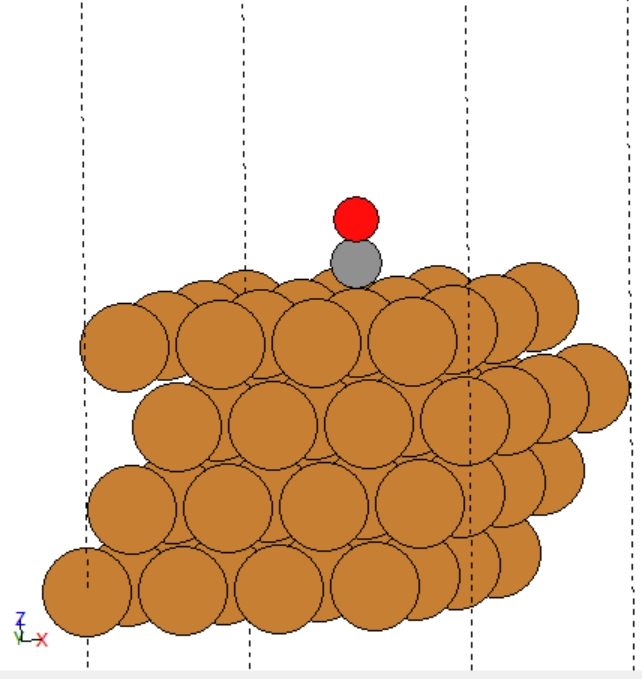
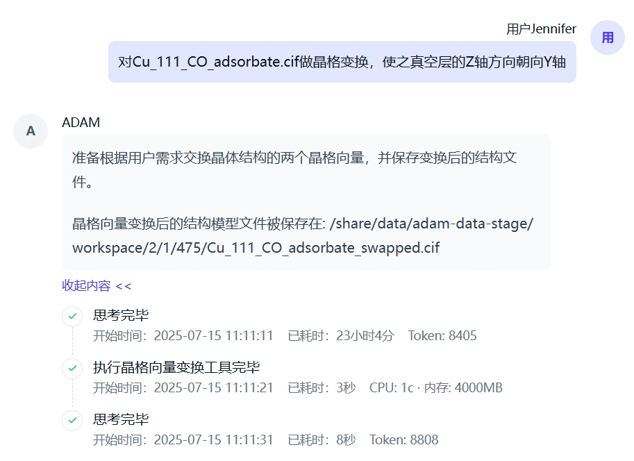
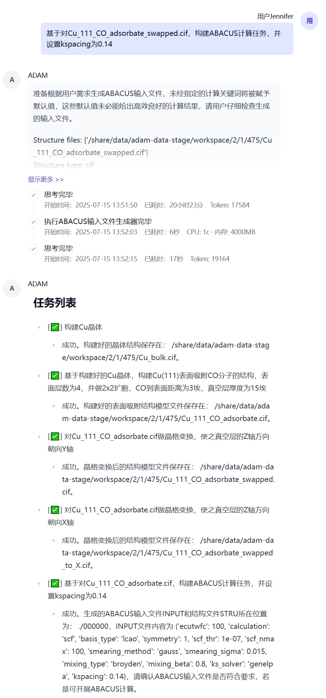

# ABACUS 如何选择晶胞朝向获得最佳并行效率？以铜表面一氧化碳吸附为例

<strong>作者：刘照清，邮箱：quanmisaka@stu.pku.edu.cn</strong>

<strong>审核：陈默涵，邮箱：mohanchen@pku.edu.cn</strong>

<strong>最后更新时间：2025/07/15</strong>

# 一、背景

不少用户会问当准备的 ABACUS 算例在 XYZ 三个方向的大小不一致时，摆放晶胞会不会对结果产生影响？如果会影响，应该怎么选取摆放的方向？相关的 Github Issue 有：[abacus/issues/3015](https://github.com/deepmodeling/abacus-develop/issues/3015)。此前已有针对一维材料和（不含真空层的）二维材料其不同晶胞朝向的计算效率测试，并通过测试结果给出了最佳计算效率方案，但这两种情况并没有囊括所有的用户需求，其中一个非常重要的需求是表面体系和表面反应体系。这类体系虽然和二维材料体系一样是二维体系，但其在垂直于表面的方向的晶格长边（一般为Z轴方向）是具有不含有任何原子的真空层的，这一真空层厚度一般在 10-15 Angstrom，从而使得真空层方向显著长于另外两个表面延展方向。

下面我们分别将真空方向设置为 X、Y、Z 方向，比较计算结果能量和时间来判断真空方向对计算的影响。

值得强调的是，后续晶胞构建，ABACUS计算和结果提取全部由ABACUS智能体完成，这一智能体以[GaliLeo科学智算平台](https://sidereus-ai.com/)为智能体平台，以[ABACUS-agent-tools](https://github.com/deepmodeling/ABACUS-agent-tools)中的智能体工具实现为基础构建。


# 二、ABACUS 做不同真空方向计算的流程

本文算例的 Cu(111) 表面吸附 CO 结构在真空层方向的长度明显大于另外两个方向，我们会采用默认的单单点电子结构计算（ABACUS 中设置 `calculation` 为 `scf`）。之前的前两个测试案例和我个人对表面体系的计算经验表明，不同晶胞朝向对原子驰豫步数（即离子步步数）和优化收敛结构并没有影响，因而选用`scf`而非结构优化（原子驰豫）计算`relax`即可体现计算效率差距。

在此前的教程中，改变真空层的方向通过对 `STRU` 和 `KPT` 文件的三列进行手动轮换实现，但这一做法其实只适合对称性较高的晶胞，并且需要对分数坐标操作。这种晶胞朝向改变本质上是晶胞自然坐标系 a, b, c 方向的轮换，可以通过手写旋转矩阵的方式来实现，也可以通过已有程序完成，如[ATOMKIT](https://vaspkit.com/atomkit.html)中的405功能可以便捷、可靠地完成这件事情，基于[ASE](https://wiki.fysik.dtu.dk/ase)也可以快速构建相关的代码。

在本教程中，Cu(111) 表面吸附 CO 的结构由 ABACUS 智能体建模，ABACUS 计算所用的`INPUT`文件由ABACUS智能体按照用户需求生成，`KPT`文件则通过`INPUT`设置的`kspacing`选项在ABACUS计算时自动生成，所用 ABACUS 版本为[LTS-v3.10.0](https://github.com/deepmodeling/abacus-develop/tree/LTS)，并基于202502版本的[gnu-toolchain](https://mp.weixin.qq.com/s/ypc0RT5ePm0vMlGRYI46JA)安装。计算采用 ABACUS 赝势-轨道库 [APNS-PPORB-v1](https://mp.weixin.qq.com/s/vUG-7uRjbMZJP2fs8Ep_8Q)的推荐赝势及其对应效率基组完成。


### 1. 结构建模和`STRU`文件

本次测试的 Cu(111) 表面吸附 CO 结构由 ABACUS 智能体建模，我们让智能体首先构建了一个Cu晶胞，然后针对其(111)面进行切面，构造层数为4且进行了(2*2)扩胞，一共有64个原子的 Cu(111)表面，并添加 15 Angstrom 的真空层，最后在切面上放置了一个 CO 分子。结构构建的对话过程如下：


构建完成后，智能体将结构保存为CIF文件，其结构如下图所示：



在后续的智能体操作中，这一结构将被转化为 ABACUS 的`STRU`结构文件。这一结构文件内容如下：

```bash
ATOMIC_SPECIES
Cu 63.546000 Cu_ONCV_PBE-1.0.upf
O 15.999400 O.upf
C 12.010700 C.upf

NUMERICAL_ORBITAL
Cu_gga_9au_150Ry_4s2p2d1f.orb
O_gga_6au_100Ry_2s2p1d.orb
C_gga_8au_100Ry_2s2p1d.orb

LATTICE_CONSTANT
1.889726

LATTICE_VECTORS
   10.21062192033     0.00000000000     0.00000000000
    5.10531096017     8.84265797145     0.00000000000
    0.00000000000     0.00000000000    39.25270341532

ATOMIC_POSITIONS
Cartesian

Cu
0.000000
64
    0.00000000000     0.00000000000    15.00000000000 1 1 1 
    1.27632774004     2.21066449286    15.00000000000 1 1 1 
    5.10531096017     4.42132898572    15.00000000000 1 1 1 
    3.82898322013     2.21066449286    15.00000000000 1 1 1 
    5.10531096017     2.94755265715    17.08423447178 1 1 1 
    3.82898322013     0.73688816429    17.08423447178 1 1 1 
    2.55265548008     2.94755265715    17.08423447178 1 1 1 
    1.27632774004     0.73688816429    17.08423447178 1 1 1 
    2.55265548008     1.47377632858    19.16846894355 1 1 1 
    3.82898322013     3.68444082144    19.16846894355 1 1 1 
    5.10531096017     1.47377632858    19.16846894355 1 1 1 
    6.38163870021     3.68444082144    19.16846894355 1 1 1 
   12.76327740042     4.42132898572    21.25270341532 1 1 1 
   11.48694966038     2.21066449286    21.25270341532 1 1 1 
    5.10531096017     4.42132898572    21.25270341532 1 1 1 
    3.82898322013     2.21066449286    21.25270341532 1 1 1 
    2.55265548008     4.42132898572    15.00000000000 1 1 1 
    3.82898322013     6.63199347858    15.00000000000 1 1 1 
    2.55265548008     0.00000000000    15.00000000000 1 1 1 
    6.38163870021     6.63199347858    15.00000000000 1 1 1 
    7.65796644025     7.36888164287    17.08423447178 1 1 1 
    6.38163870021     5.15821715001    17.08423447178 1 1 1 
    5.10531096017     7.36888164287    17.08423447178 1 1 1 
    3.82898322013     5.15821715001    17.08423447178 1 1 1 
    5.10531096017     5.89510531430    19.16846894355 1 1 1 
    6.38163870021     8.10576980716    19.16846894355 1 1 1 
    7.65796644025     5.89510531430    19.16846894355 1 1 1 
    8.93429418029     8.10576980716    19.16846894355 1 1 1 
    5.10531096017     8.84265797145    21.25270341532 1 1 1 
    3.82898322013     6.63199347858    21.25270341532 1 1 1 
    7.65796644025     8.84265797145    21.25270341532 1 1 1 
    6.38163870021     6.63199347858    21.25270341532 1 1 1 
    5.10531096017     0.00000000000    15.00000000000 1 1 1 
    6.38163870021     2.21066449286    15.00000000000 1 1 1 
   10.21062192033     4.42132898572    15.00000000000 1 1 1 
    8.93429418029     2.21066449286    15.00000000000 1 1 1 
   10.21062192033     2.94755265715    17.08423447178 1 1 1 
    8.93429418029     0.73688816429    17.08423447178 1 1 1 
    7.65796644025     2.94755265715    17.08423447178 1 1 1 
    6.38163870021     0.73688816429    17.08423447178 1 1 1 
    7.65796644025     1.47377632858    19.16846894355 1 1 1 
    8.93429418029     3.68444082144    19.16846894355 1 1 1 
   10.21062192033     1.47377632858    19.16846894355 1 1 1 
   11.48694966038     3.68444082144    19.16846894355 1 1 1 
    7.65796644025     4.42132898572    21.25270341532 1 1 1 
    6.38163870021     2.21066449286    21.25270341532 1 1 1 
   10.21062192033     4.42132898572    21.25270341532 1 1 1 
    8.93429418029     2.21066449286    21.25270341532 1 1 1 
    7.65796644025     4.42132898572    15.00000000000 1 1 1 
    8.93429418029     6.63199347858    15.00000000000 1 1 1 
    7.65796644025     0.00000000000    15.00000000000 1 1 1 
   11.48694966038     6.63199347858    15.00000000000 1 1 1 
   12.76327740042     7.36888164287    17.08423447178 1 1 1 
   11.48694966038     5.15821715001    17.08423447178 1 1 1 
   10.21062192033     7.36888164287    17.08423447178 1 1 1 
    8.93429418029     5.15821715001    17.08423447178 1 1 1 
   10.21062192033     5.89510531430    19.16846894355 1 1 1 
   11.48694966038     8.10576980716    19.16846894355 1 1 1 
   12.76327740042     5.89510531430    19.16846894355 1 1 1 
   14.03960514046     8.10576980716    19.16846894355 1 1 1 
   10.21062192033     8.84265797145    21.25270341532 1 1 1 
    8.93429418029     6.63199347858    21.25270341532 1 1 1 
   12.76327740042     8.84265797145    21.25270341532 1 1 1 
   11.48694966038     6.63199347858    21.25270341532 1 1 1 

O
0.000000
1
    7.65796644025     4.42132898572    24.25270341532 1 1 1 

C
0.000000
1
    7.65796644025     4.42132898572    23.10236341532 1 1 1 
```

可以看到：
- 智能体构建的表面吸附体系，其真空层（长边）方向在 Z 轴方向，这是符合表面吸附体系模拟的常规做法的。
- 这一表面结构不是四方晶系，而是六方晶系。在进行晶胞朝向调整时，不一定能用简单的`LATTICE_VECTORS`轮换来实现，而是需要对晶胞的自然坐标系进行旋转。同时，也不能对笛卡尔坐标进行轮换操作，而是要对分数坐标进行轮换操作。

通过与智能体对话，我们可以通过旋转晶格矢量，进一步构建不同真空层方向的这一表面体系。这一步骤也可以通过ATOMKIT等工具自行实现，相关对话如下：




这些表面体系的`LATTICE_VECTORS`是一个 3×3 矩阵，代表我们所计算体系在 X, Y, Z 三个方向上的晶格矢量 a, b, c 大小，它们由 `LATTICE_CONSTANT`（晶格常数）进行缩放，此处晶格常数为 1.889726 Bohr, 即 1 Angstrom。可以参考[https://abacus.deepmodeling.com/en/latest/advanced/input_files/stru.html#lattice-vectors](https://abacus.deepmodeling.com/en/latest/advanced/input_files/stru.html#lattice-vectors)。它们的对比如下：

```bash
# 真空层在Z轴方向的LATTICE_VECTORS
LATTICE_VECTORS
   10.21062192033     0.00000000000     0.00000000000
    5.10531096017     8.84265797145     0.00000000000
    0.00000000000     0.00000000000    39.25270341532
# 真空层在Y轴方向的LATTICE_VECTORS
LATTICE_VECTORS
   10.21062192033     0.00000000000     0.00000000000
    0.00000000000    39.25270341532     0.00000000000
    5.10531096017     0.00000000000     8.84265797145
# 真空层在X轴方向的LATTICE_VECTORS
LATTICE_VECTORS
   39.25270341532     0.00000000000     0.00000000000
    0.00000000000    10.21062192033     0.00000000000
    0.00000000000     5.10531096017     8.84265797145
```
不难看出，虽然各个`LATTICE_VECTORS`的分量数值没有变化（这得益于六方晶系的对称性依然不低），但其位置不再是简单轮换。因而对于非四方晶系的体系，相关的晶胞朝向调整需要采用专门代码或者专门工具进行。

### 2. `INPUT` 文件

本次计算的`INPUT`文件和`STRU`文件由ABACUS-Agent基于CIF文件准备，准备方式如下所示：



从智能体的输出中我们可以提取出所用的INPUT。

```bash
INPUT_PARAMETERS
ecutwfc          100
calculation      scf
basis_type       lcao
kspacing         0.14
symmetry         1
scf_thr          1e-07
scf_nmax         100
smearing_method  gauss
smearing_sigma   0.015
mixing_type      broyden
mixing_beta      0.8
ks_solver        genelpa
```

可以看到，`INPUT`文件中设置了`calculation`为`scf`，即单点电子结构计算，`kspacing`为0.14，这一值是用户的要求设置。其他参数均为 ABACUS LTS 版本下开展SCF计算的合理默认值。

### 3. `KPT` 文件

在开展计算时，ABACUS 会根据`INPUT`文件中的`kspacing`参数自动生成`KPT`文件。对于本次测试的 Cu(111) 表面吸附 CO 结构，当真空层在 Z 轴方向时，生成的`KPT`文件内容如下：

```bash
K_POINTS
0
Gamma
3 3 1 0 0 0 
```
需要注意的是，真空层方向的K点数目一般需要显式设置为1，以防止计算中混入不应存在的层间周期性。此处由`kspacing`参数自动生成的`KPT`文件是满足要求的。


# 三、测试结果

测试计算由智能体调用计算资源完成，计算核数为 16 核，采用 MPI 方式并行，计算平台的CPU型号为Intel(R) Xeon(R) Platinum 9242 CPU @ 2.30GHz。测试结果由智能体统计。下表给出本次测试的总能量，电子步数和计算时间消耗，我们通过比较总能量和时间差异来判断真空层方向对计算结果的影响，可以看到，系统总能量和电子步迭代步数并不会受到不同真空层取向的影响，但计算时间会受到显著影响。真空层摆放在Z方向时，单电子步用时和总计算时间显著大于其他两个方向，达到了其他两个方向的三倍以上。


| 真空层朝向  |   系统总能量 (eV)    | 计算总时间 (s) | 总电子步数 | 单电子步用时 (s) | 
| ---------- | ------------------  | ------------- | --------- | --------------- |
| X          | -318603.9704461048  |   1432.47     |   39      | 35.77 ~ 47.09   |
| Y          | -318603.9704469827  |   1421.25     |   39      | 35.37 ~ 46.94   |   
| Z          | -318603.9704470374  |   4725.36     |   39      | 120.24 ~ 131.01 |

根据以上测试结果，建议读者们在进行表面和表面反应等含真空层体系的计算时，让真空层规避 Z 方向，并将表面的长边摆放在 Z 方向，以获得 ABACUS 计算时的最大效率。同时，对于六方晶系或者类似于六方晶系的表面，则可将真空层摆放在 Y 方向，以获得最大的计算效率。
